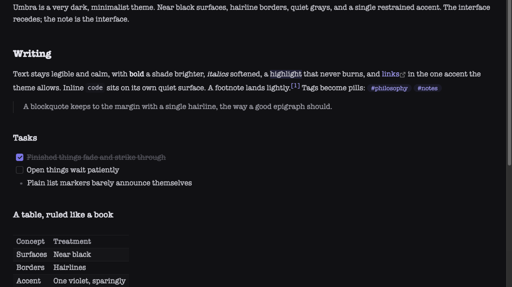

# Umbra

An Obsidian theme named for the darkest part of a shadow: **very dark, very quiet, one restrained accent**.

If this theme adds value for you and you would like to help support
continued development, please use the buttons below:

&nbsp;&nbsp;

<strong><a href="https://buymeacoffee.com/philosophizer">☕ Buy me a coffee</a></strong>&nbsp;&nbsp;·&nbsp;&nbsp;<strong><a href="https://www.paypal.com/donate/?business=berlin.philosophy%40gmail.com&no_recurring=0&currency_code=EUR">💙 Donate via PayPal</a></strong>

If you like this theme or find it useful, please consider giving it a <a href="https://github.com/kebl3541/Obsidian-Umbra">star</a>  on GitHub!

Near black surfaces, hairline borders in place of visible chrome, muted grays for everything that is not your text, and a single desaturated violet for links, tags, and the caret. Headings differ by weight, not by color. The interface recedes; the note is the interface.

## Design choices

- The editor sits on near black (#09090c); sidebars are one shade away, separated by hairlines rather than panels.
- Your fonts are respected. Umbra sets weights and rhythm, never typefaces.
- Inactive tabs, the ribbon, the status bar, and frontmatter properties stay dim until you interact with them.
- Completed tasks fade and strike through; list markers and indentation guides are barely there.
- Shadows are gone except under popovers, where depth is information.
- Dark mode only, by design.

## Choose your own accent

Umbra allows itself one color, and you choose it. Install the community plugin **Style Settings**, then open Settings, Style Settings, Umbra: a color picker sets the accent, and links, tags, the caret, checkboxes, selections, the active tab, and the graph all follow, each at its own carefully weighted intensity. No plugin, no problem: the default is a desaturated violet.

## Install

From the community theme store: Settings, Appearance, Themes, Manage, search for Umbra. Or manually: copy `manifest.json` and `theme.css` into `<your vault>/.obsidian/themes/Umbra/`, then pick Umbra under Settings, Appearance, Themes.

## License

MIT © [kebl3541](https://github.com/kebl3541)
